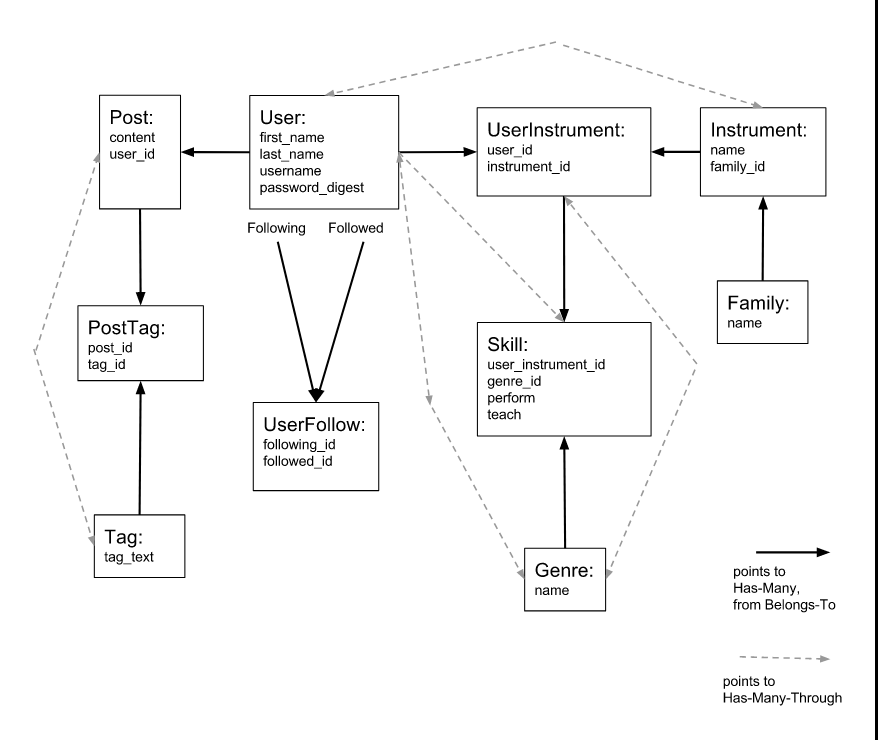

# syncedIn-backend

demo: https://www.youtube.com/watch?v=U9JzufNzcGU&t=15s

frontend repo: https://github.com/annabush092/SyncedIn-frontend

built with: Ruby on Rails api, postgres database

To run:

rake db:create

rake db:migrate

rake db:seed

rails s (be sure to start this server before starting up the frontend)

Validations:

  User: username is required and unique, password is required

  Instrument: name is required and unique

  Family: name is required and unique

  Genre: name is required and unique

  Post: content is required

  Tag: tag_text is required and unique

  UserFollow: has no duplicate entries

  UserInstrument: has no duplicate entries

  PostTag: has no duplicate entries

  Skill: has no duplicate entry of user_instrument_id + genre_id

Database Structure:

